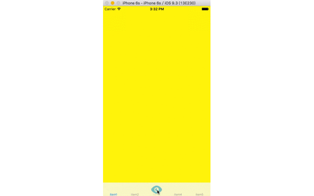

###QYOptionButton###
######模仿新浪微博的中间选择按钮######
####使用步骤####

1. tabbarViewController中添加如下代码
 
	`_ = QYOptionButton(tabbar: self.tabBar, forItemIndex: 2, delegate: self)`

2. 实现QYOptionButton的代理方法

		func QYOptionNumberOfOptionButtonItem(optionButton: QYOptionButton) -> Int {
        	return 7
    	}
    	
    	func QYOptionItemAtIndex(optionButton: QYOptionButton, itemAtIndex index: Int) -> QYOptionItem {
        let optionItem = QYOptionItem(frame: CGRectMake(0, 0, 64, 64))
        optionItem.setImage(UIImage(named: "icon_holder"), forState: UIControlState.Normal)
        //为该按钮添加事件
		//optionItem.addTarget(self, action: #selector(anAction), forControlEvents: UIControlEvents.TouchUpInside)
        	return optionItem
   		}

		//调整OptionButton上下的位置
    	func QYOptionAdjustUpAndDownForOptionButtonItem(optionButton: QYOptionButton) -> CGFloat {
        	return 0
    	}
    
    	func QYOptionNormalImage(optionButton: QYOptionButton) -> UIImage {
        	return UIImage(named: "middle_selected")!
    	}
    
    	func QYOptionSelectedImage(optionButton: QYOptionButton) -> UIImage {
      	  return UIImage(named: "middle_selected")!
    	}

####演示####
